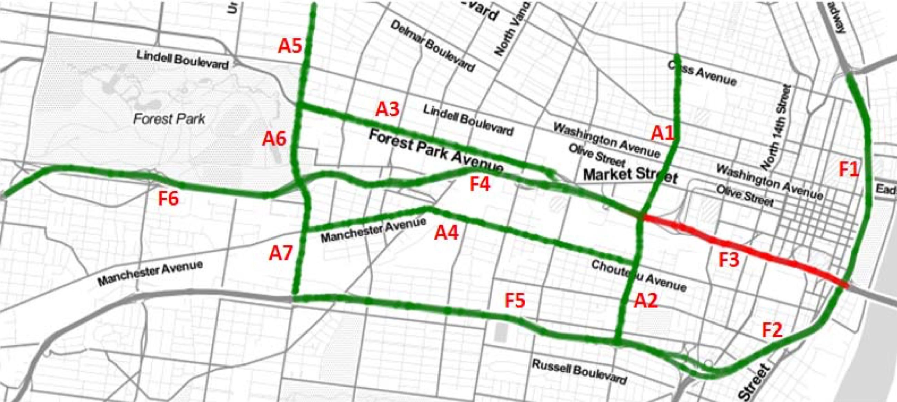
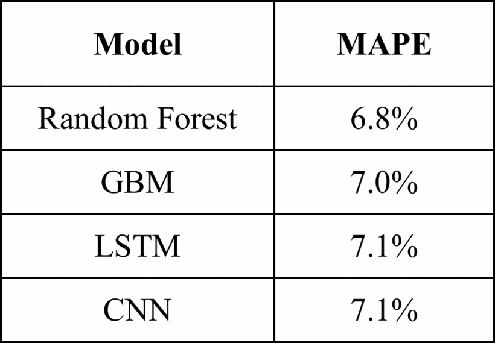
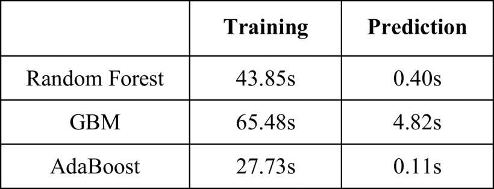
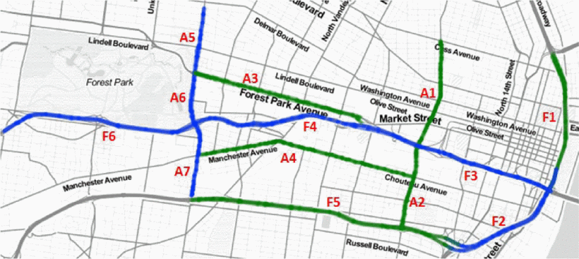
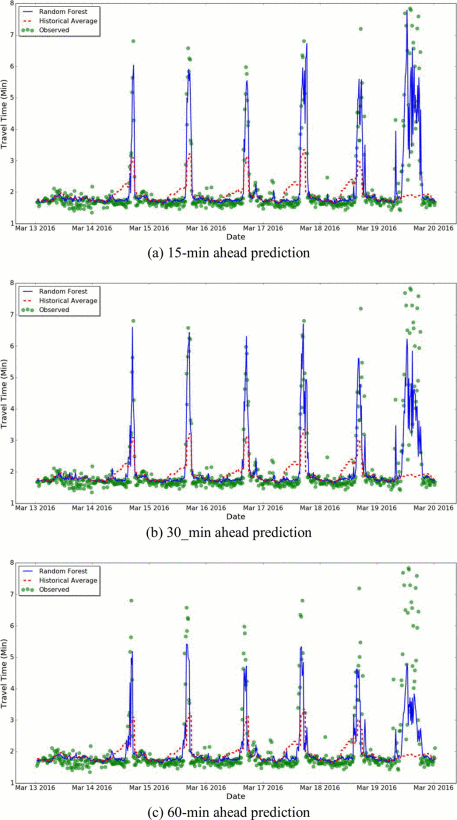

### 1. Abstract and Introduction
+ Summary and background of the topic:[1]
> We are living in the century of big data. The effective use of data is becoming the key competency of almost any business in any industry. To make the right choices in the right time from data the concept of adaptive business intelligence (ABI) is created.  Apart from the original Business Intelligence (BI), ABI gives more attention to the facts that data are increasing and changing dramatically in every minute. This ABI system must be able to self-learn so that it can give real-time near-optimal the solutions or decisions reflecting this changes.

+ Why it is important (1)
> Random Forests (RF) is the extension of classification or regression trees, which means they are a combination of relatively simple models. By increasing the number the trees, the overfitting is effectively controlled or eliminated [1]. In modern ABI Systems, RF is becoming more and more important due to its significantly lower risk of overfitting and less variance, Which means a comparable accuracy.

+ How it has been studied or developed (1)
> In recent years, RF has been studied a lot and widely used in many area. In 2016, Random Forests was use to discover the relationship of Financial Record stored in different database [4]. In 2017, a novel random forests based class incremental learning method is proposed to recognize human activity automatically [2]. In 2018, a cascaded Random Forest is developed for hyper-spectral image classification [3]. This paper reviews the Random Forest techniques in ABI territory and Improve ground-level PM 2.5 concentration mapping using a random forests-based geostatistical approach

### 2. Concept and Theory[10]:
+ Good Description of the Concept and Theory (2)(In general)
> RF are usually referred as an ensemble of Decision Trees (TR). The image below illustrates an informal DT which is a classification tree (Classifier).

> Figure 1. [6]
>
> For each node features are select to split the data into classes and decided which class this node belongs to. For example, in the above DT, nodes are firstly divided into two classes by the feature that whether it is a student or not. RF combine a set of small DT which created by embedding bootstrap random sampling and adopting Gini index as a feature selection standard [2].

+ How the Concept and Theory related to ABI (2)
> In ABI systems, data mining plays a very important role, which generates knowledges from information. There are two kinds of data mining, verification and discovery regarding to its mining goal. Verification data mining methods aim to the goodness of fitting hypothesis, while discover methods are used to identify patterns. These result patterns can help us either describing the underlying rules or predicting the values we are interested. The discover method for predicting are also mentioned as supervised learning or supervised model. It can be divided into Classification Model and Regression Model, these are the most popular kinds of model in Data Science. DT is the approach that can be adopted in both Classification as well as Regression [7].
> Apart from the traditional role of BI, ABI give more emphasis on building decisions automatically and continuously. There are a large number of studies on RF. Thanks to many state-of-the-art algorithm, the RF has become a efficient and effective learning method in online learning and incremental learning domains [2].

+ Advantages of the technique (2)
> In the ABI domains, RF has some key advantages as below:
> 1. RF is suitable for both Classification models regression Models.
> 1. Small training time: ABI systems are required to handle large data and or even data streams. RF's components DT are independent trees, they can be build simultaneously on different CPU cores. This dramatically increase the speed of decision generation [8].
> 2. High accuracy: DT is simple and strict-forward, however, a slightly change of the data can drastically affect the features selection and so affect the whole structure of tree. By subsampling N decision trees, the potential variance and bias are reduced and removed.
> 3. RF can give better result in Classification [1].

+ Disadvantages of the technique (2)
> RF also have several disadvantages, such as parallel training may not be applicable in a real scenario.
>

+ Limitations of the technique (2)
Good Description of the Concept and Theory (2)(In general)

### 3. Application[10]:
##### Example application related to ABI (2)  (specific)
> According to Michalewicz et.al. [9], a Adaptive Business Intelligence System should be able to deal with real problems in the time-changing world, and should be resistible to the complexity of vast constrains. Prediction and Optimization are the key to those techniques or models involved in Adaptive Business Intelligence.
In modern cities, travel time is the most important criteria of traffic condition. It usually reflect the city development level. In contract to other intelligence system that only demonstrate the current congestion or recurring rush hour on the roads. A real-time prediction on travel times have great significance not only to the drives but also to the traffic light systems and urban planning. In recent years, many studies focus on using Random Forest to predict the travel times.  

##### Detailed explanation on how to apply the technique on the specified application (2)
> 2017, Hou et.al.[10]. studied the Road Network State Estimation using Random Forest Ensemble Learning. The traffic data came from the St. Louis, USA. They are real traffic data in two years, from June 2014 to May 2016. Firstly, the researchers pick up one load as the predicting target, which is F3 shown in red colour in the image below:   
> Figure 2.
> The historical travel time of F3(in red) and the other roads in the same area (in green) were used to train the Random Forest Model. Bagging method was use to build the test-sets. Out-of-bag dataset was used to assess the model. In order to evaluate this Random Forest model, the authors perform the same experiment on a Baseline Predictor model and another two models named: Gradient Boosting Machines (GBM) and AdaBoost. They were then compared with the same criteria: mean absolute percentage error (MAPE).   
> After this, the Random Forest model was applied to the complex real problem in real-time, predicting the network scale road travel time. This time, they compared Random Forest model with GBM model and another two models: long short term memory (LSTM) and convolutional neural network (CNN). The results showed that Random Forest can outperform its rivals in many aspects.

##### Advantages of using the technique on the application (2)  （Based on the Application）

**The advantages of using Random Forest method in travel time prediction can be list as below:**

1. Random Forest's performance can ben highly optimized by parameter selection.
For example, in the single road prediction test, after setting the tree depth: size of terminal node as 5, number of variables as 18, number of tree about 100, this model reach the top accuracy. The test result indicate that the Random Forest had less mean absolute percentage error (MAPE) than all its opponents: Baseline Predictor, GBM and AdaBoost.  
  

Table I

When applying to a 13-roads networks, Random Forest model still outperform the Baseline and GBM model. Another two deep learning model CNN and LSTM were added for comparison. This two methods can are parallel training models, they can calculate these 13 roads at the same time. However, they still can win Random Forest.

Table II

2. Random Forests are very quick to train and to predict.
Table I shows that Random Forest model finished training and gave prediction in a relatively short time, although computational test was run on a not very high power computer.
  

Table III. Computation Times

3. After the training, Random Forest can reveal that which features are more important.
The importance is calculated by Gini index. It is very helpful for human to understand the relationship between all kinds of constrains and target. Fig 3 illustrates that the historical variables of road F6, A6, F4, F2 and F3 itself are very important in predicting the F3's travel time in the 1 hour future.  

  

Fig 3. Most relevant road for 1 hour ahead travel time of F3.

4. Random Forest can easily used the out-of-bag datasets for validation. Thus, no extra workload is needed to build the test set for Cross-Validation.

5. Random Forest is not sensitive to missing data. In this application, 0.5% of data were missing, they were replaced by mean values. This kind of approach does not affect the result accuracy.

6. The Random Forest model in this application was sensitive to emergency and abnormal condition. It can predict the abnormal congestion of the target road according to the other roads historical travel times.

##### Disadvantages of using the technique on the application (2) （Based on the Application）
The using Random Forest on Road Network travel time estimation had several disadvantages. First, the big noise in some Classifier may lead to overfitting. Therefor, the trial and error approach was adopted to find out the best depth of the trees or the minimal size of nodes.
Second, Random Forest model can not explain why there were spatial effects. Some travel time of the roads far away from the target road can have more significant influence on the prediction. While the data of some neighbor roads had less impact.
Third, how the continuous values were split into different classes may have significant impact on the structure of Random Forest. This maybe the reason why freeway segments obtained less accuracy compared to signalized arterials.

##### Other available techniques that can be used for the specified application (2)
Other available techniques such as gradient boosting method (GBM) and Adaboost algorithm (Adaboost) were studied to improve the prediction.
1. Not like Random Forest, GBM technique does not average the results of trees in the forests. Instead, it builds the tree models one by one. The latter model fix the error brought by the preceding model. This building process is under the guidance in order to obtain a better prediction.
2. Adaboost algorithm is a famous algorithm in boosting methods. It tooks Random Forest as a week learner. In the training precess, more weight were set to the training sets which have higher error rate. At the end, it combine all the learner into the powerful learner which is the final model. The disadvantage of Adaboost is that the abnormal data may accumulate it weight then finally affect the accuracy.

### 4. Future Development and Conclusion[3]:
+ The future of the technique (1)
In the future, more and more improved Random Forest model will be proposed, along with many high efficient and free libraries in R and Python languages will be developed. People can then easily adopted these outstanding models to settle their problem.

+ The future of the technique in relation to ABI (1) (也许合适将来但不适合现在)
For example, it is used in Hyperspectral Image Classification, uncovering Financial Entity Record Linkage, improving ground-level PM2.5 concentration and Activity Recognition etc.

+ Conclusion (1)
In conclusion, Random Forest is a simple, straight-forward but effective technique in capturing knowledges from information. It has may outstanding advantages and has been studied and improved to a great extent. Although it still has some drawback in some areas, but this will not stop the data scientists to put more effort to it. 

### 5. References[4]:
+ References and citations (1),
+ report structure (1),
+ English quality (1)
+ and word limit (1)

[1] Leo Breiman. 2001. Random Forests. Machine Learning 45, 1 (2001), 5–32. DOI: http://dx.doi.org/10.1023/A:1010933404324

[2] Hu, C., Chen, Y., Hu, L., & Peng, X. (2018). A novel random forests based class incremental learning method for activity recognition. Pattern Recognition, 78, 277-290.

[3] Szegedy, C., Liu, W., Jia, Y., Sermanet, P., Reed, S., Anguelov, D., ... & Rabinovich, A. (2015, June). Going deeper with convolutions. Cvpr.

[4] Kim, K., & Giles, C. L. (2016, June). Financial Entity Record Linkage with Random Forests. In Proceedings of the Second International Workshop on Data Science for Macro-Modeling (p. 13). ACM.

[5] Lior, R. (2014). Data mining with decision trees: theory and applications (Vol. 81). World scientific.
DATA MINING WITH DECISION TREES
In data mining, a decision tree is a predictive model which can be used to represent both classifiers and regression models. In operations research, on the other hand, decision trees refer to a hierarchical model of decisions and their consequences. The decision maker employs decision trees to identify the strategy most likely to reach her goal.

When a decision tree is used for classification tasks, it is more appropriately referred to as a classification tree. When it is used for regression tasks, it is called regression tree.

[6] tree image https://www.edureka.co/blog/decision-trees/

[7] Introduction to Decision Trees.

[8] Genuer, R., Poggi, J. M., Tuleau-Malot, C., & Villa-Vialaneix, N. (2017). Random forests for big data. Big Data Research, 9, 28-46.

[9] Michalewicz, Z., Chiriac, C., & Michalewicz, M. (2006). Adaptive business intelligence. Retrieved from https://ebookcentral.proquest.com

[10] Hou, Y., Edara, P., & Chang, Y. (2017, October). Road network state estimation using random forest ensemble learning. In Intelligent Transportation Systems (ITSC), 2017 IEEE 20th International Conference on (pp. 1-6). IEEE.
